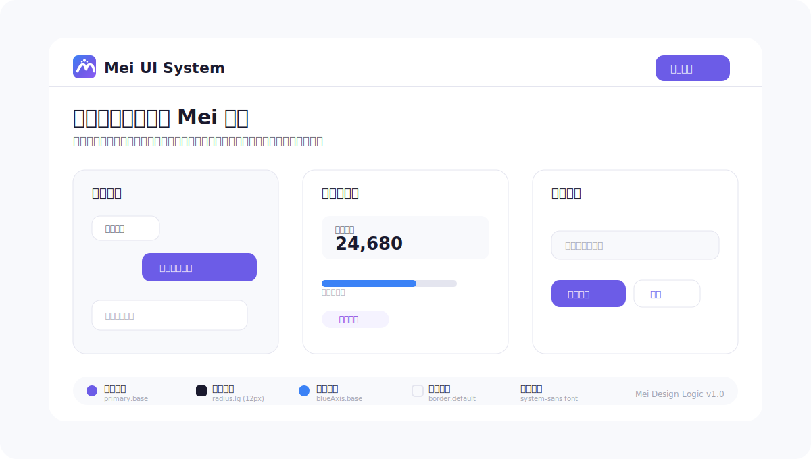

# Mei UI 系统 (Mei UI System)

Mei UI 系统是一个面向 AI 辅助项目的共享 UI 标准。

其目的是使不同的 AI 代理和不同的项目能够产生一致的视觉风格：蓝紫色彩体系、一致的 Token、统一的组件规则、布局密度以及 Mei 品牌资产。



## AI 快速入门

AI 和其他自动化系统必须将 `ai.md` 作为执行入口点。

1. 阅读 `ai.md`。
2. 按照 `ai.md` 定义的顺序阅读 Token 文件。
3. 阅读 `patterns.md` 以决定产品类型、密度和布局。
4. 阅读 `components.md` 以选择组件组合规则。
5. 在使用或创建任何 logo / 应用图标 / favicon 之前，阅读 `brand.md`。
6. 仅使用 Token 路径生成 UI；**严禁**硬编码颜色、间距、圆角、阴影或字体排版。

## 品牌规则

如果目标项目没有现有的 logo / 应用图标 / 品牌标识，必须使用 `assets/logo/` 中的 Mei 默认 logo 资产。

禁止为每个项目重新设计、换色、拉伸或替换 Mei logo。

## 目录结构

```
tokens/       → JSON 设计变量 / Design Tokens (事实来源)
assets/logo/  → 统一的 Mei Logo 资产 (SVG 源码 + PNG/favicon 导出文件)
ai.md         → AI 执行规则与指令
patterns.md   → 按产品类型划分的布局模式
components.md → 组件组合规则
brand.md      → Logo 及品牌使用规则
```
